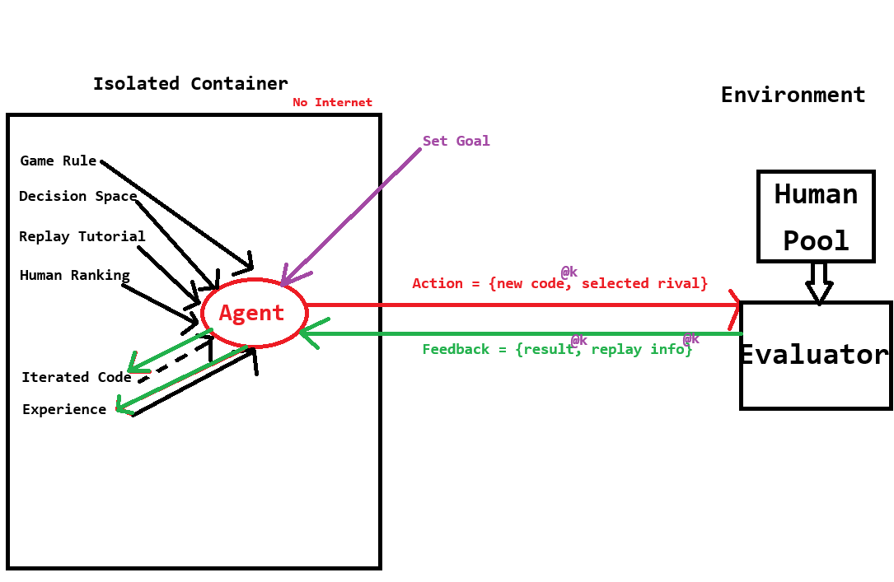

# AgentBench-HL



AgentBench-HL 是一个可复现的 Human-Level（HL）博弈策略研究框架。它把长程代码
研究交给同一个持久 Codex Goal，把可审计的实验事实交给确定性内核：候选版本、官方
对局、回放、指标、经验与实验账本均由框架保存和复算。

当前提供完整的 AntWar2 GamePack；同一接口用于接入后续游戏。

## Goal-led 闭环

```text
冻结 GamePack + 公开 SDK + 排行榜
              │
              ▼
    隔离的持久 Codex Goal
    读取自身策略 / Experience / 公开回放
              │ action: 新候选 + 目标对手
              ▼
确定性框架：封存版本、运行官方对局、计算指标
              │ feedback: 比赛结果 + 自然语言回放
              └────────────────────────────────────► Goal
```

Goal 可以编写条件规则、状态机、路径规划、启发式评分、资源预算或确定性搜索等
可解释代码。它不能访问人类选手源码、隐藏认证矩阵、参考策略或其他 run 的记忆；
框架只向它返回公开对局结果和回放。

## K=4 策略 rollout 协议

一次探索不是让同一个候选在大量 seed 上重复比赛。默认从同一个 parent 提交四个
机制不同的策略候选（`k=4`），在相同的诊断对局条件下各打一局。Goal 读取四份公开
回放，比较生产、战斗、资源和终局轨迹，再选择下一步的策略方向。

胜出或出现显著改善的候选才追加少量确认局。对 rank01 的“稳定击败”使用四个固定
seed 的角色均衡检查；它是晋升门槛，不是每个探索候选的常规成本。Elo 同样只在候选
进入 Frontier 或 Champion 时，用信息量最大的少量对手更新，而不对全部人类池穷举。

`action.json` 已支持多个 `candidate_ids`：当候选数大于一时，每个候选的完整工作区
快照放在 `.agentbench/rollouts/<candidate_id>/`，框架会封存它们并分别返回回放。

## 快速开始

要求：Python 3.11+、C++17/GNU Make、可运行 Codex App Server 的 `codex` 二进制，以及
冻结的 [Aoraku/AgentBench](https://github.com/Aoraku/AgentBench) 后端。

```bash
git clone https://github.com/Aoraku/AgentBenchHL.git
cd AgentBenchHL
python3 -m venv .venv
.venv/bin/python -m pip install -e '.[dev]'
cp .env.example .env
chmod 600 .env
```

在 `.env` 中填写本机密钥和冻结后端路径：

```dotenv
ABHL_API_KEY=your-provider-key
AGENTBENCH_ROOT=/absolute/path/to/Aoraku/AgentBench
```

`.env` 从不进入 Git。模型、镜像地址、reasoning effort、网络策略和运行上限由实验
YAML 固定；请按本机 provider 修改对应配置，而不是把密钥写入 YAML。

启动一个新的 Scheme I Goal-led run：

```bash
abhl goal-led start \
  --config configs/experiments/antwar2-goal-I.yaml \
  --run-id antwar2-goal-I
```

每次 `start` 或 `continue` 只推进同一个持久 Goal 至下一个已提交 action 或反馈点；
可以安全中断和恢复：

```bash
abhl goal-led continue \
  --config configs/experiments/antwar2-goal-I.yaml \
  --run-id antwar2-goal-I
```

不要并发执行同一 `run-id`。运行根目录默认为仓库外的 `../runs/<run-id>/`，其中的
候选、回放、App Server 状态和指标均是本地实验产物，不提交到 Git。

## 仓库结构

```text
configs/experiments/       可冻结的运行配置
gamepacks/<game>/          每个游戏的可移植研究输入
  rules.md                 规则
  decision_space.yaml      原子、合法的决策空间
  replay_skill.md          JSON 回放到自然语言事实的读法
  sdk_interface.md         候选公共接口
  manifest.yaml            GamePack 清单与隔离边界
  candidate_support/       候选可调用的公共支持代码
src/agentbench_hl/         Goal 协议、版本账本、评测、指标与适配器
tests/                     单元、合同、回放 golden 与端到端测试
docs/                      复现协议和 GamePack 接入说明
```

## 接入一个新游戏

协作者只需要实现游戏特有且必须由人定义的内容：规则、最本源的原子决策空间、回放
阅读 Skill、候选公共接口，以及 arena/replay adapter。后端调用、版本保存、经验积累、
IG/Elo/胜率/分差曲线和 Codex Goal 生命周期由框架统一处理。

详见 [GamePack 接入指南](docs/gamepack-authoring.md)。

## 指标与可复现性

每个整数 `research_iteration` 可记录：

- 行为信息增益：共享、合法决策状态上的 epsilon-smoothed one-hot KL；
- Elo：候选对冻结人类池的完整对局结果；
- 胜率与终局分差；
- token 用量与 wall time；
- 原始回放、自然语言回放事实、Experience Skill 与不可变候选谱系。

完整运行、隔离、审计和认证条件见 [复现协议](docs/reproducibility.md)。

## 开发检查

```bash
python -m pytest -q
python -m ruff check src tests
git diff --check
```

带 `live` 标记的测试可能需要本机 Codex App Server 或 provider，不会在默认测试中运行。
