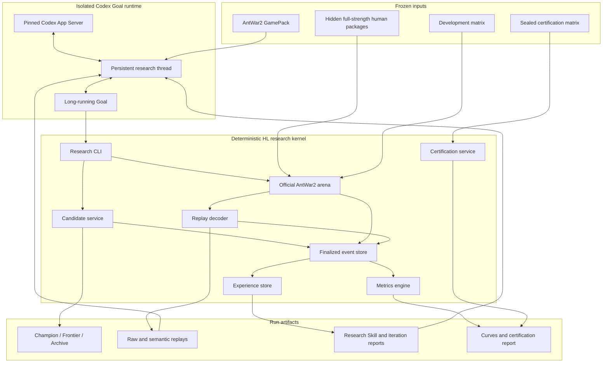
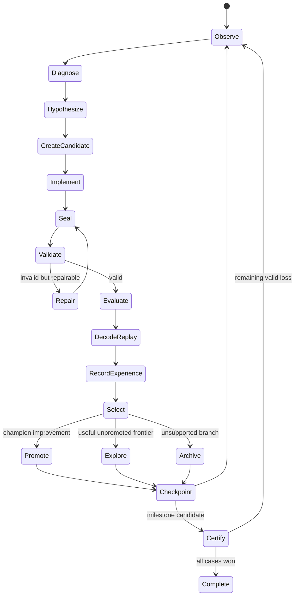

# AntWar2 Goal-Led Human-Level Research Framework Design

## 1. Objective

Build a reproducible, from-scratch Human-Level (HL) research system for
AntWar2. A persistent Codex Goal owns research decisions and policy editing.
A deterministic research kernel owns the official game, candidate lineage,
evaluation, replay semantics, scientific metrics, resource accounting,
experience retention, and certification.

The experiment terminates successfully only when one explainable policy wins
every valid case in the frozen certification matrix against every runnable
human submission. There is no configured iteration or token ceiling. API
exhaustion pauses the run without changing its scientific state.

## 2. Scope

### 2.1 Included

- AntWar2 only.
- A Goal-led runtime backed by Codex App Server JSON-RPC.
- An isolated, run-specific Codex home and persistent thread.
- A from-scratch `v000` generated from the GamePack before any human replay is
  visible.
- Full-strength official human submissions and the frozen official game.
- Bottom-up opponent curriculum over runnable official ranks.
- Explainable deterministic program policies.
- Immutable candidates, Champion/Frontier/Archive lineage, branching, fusion,
  and rollback.
- Machine-readable and human-readable replay interpretation.
- Positive, negative, mixed, inconclusive, integration-failure, and
  not-activated experience retention.
- Behavioral information gain, occupancy shift, fixed-pool Elo, win rate,
  score margin, token use, wall time, and budget AUC.
- Crash-safe resume and finalized-only event logging.

### 2.2 Excluded

- Rollman and other games.
- Website or server deployment.
- A Framework-led multi-agent scheduler.
- Training opaque neural policies.
- Importing human source code, AntWar2 versions `v22` through `v239`, their
  replays, their Skills, or their research reports into the learning context.
- Weakening, time-shortening, replacing, or otherwise modifying human
  submissions for scientific matches.

The package layout reserves an `AgentRuntime` port so a Framework-led Codex
App Server runtime can reuse the kernel in a separate project phase.

## 3. Research Contract

### 3.1 Goal charter

The frozen Goal charter instructs Codex to:

1. understand the rules, SDK, public state, legal atomic decisions, and replay
   semantics;
2. construct an initial explainable policy from the rules alone;
3. play unmodified human submissions through the official engine;
4. turn public replay trajectories into grounded natural-language behavior;
5. state a replay-grounded condition, mechanism, intervention, and expected
   observation for each candidate;
6. preserve supported and refuted experience;
7. improve the policy until it wins the complete certification matrix.

Explainable code may contain condition trees, finite-state machines, path
planning, heuristic scoring, resource budgets, deterministic search, and
role-specific logic. It may grow without a source-size penalty. It must expose
enough named structure and trace output to explain why a public state produced
an operation.

### 3.2 Learning isolation

The Goal may read only:

- the frozen GamePack;
- the active candidate workspace and its ancestors selected through lineage;
- public match outputs generated by the run;
- run-local Experience and research reports;
- documented research CLI help.

The human package store and certification seed material are mounted only in
the evaluator process. Candidate processes and Codex tools cannot read those
paths. The run uses a dedicated `CODEX_HOME`, API-key authentication, disabled
cross-run memory, explicit instructions, a frozen model/provider
configuration, and a pinned Codex binary and protocol schema.

## 4. Architecture



Codex decides what to investigate, which public replay evidence to inspect,
how to alter policy code, which lineage parent to use, and whether an
unpromoted branch merits continuation. The kernel decides whether an artifact
exists, whether a match is valid, which version was evaluated, how metrics are
computed, and whether certification succeeded.

## 5. Repository Layout

```text
AgentBench-HL/
├── pyproject.toml
├── README.md
├── LICENSE
├── configs/
│   ├── experiments/
│   │   ├── antwar2-goal-k1.yaml
│   │   └── antwar2-goal-k4.yaml
│   └── providers/
│       └── openai-compatible.example.toml
├── gamepacks/
│   └── antwar2/
│       ├── manifest.yaml
│       ├── GOAL_CHARTER.md
│       ├── rules.md
│       ├── decision_space.yaml
│       ├── replay_skill.md
│       └── development_matrix.yaml
├── evaluator-config/
│   └── antwar2-certification.yaml
├── src/agentbench_hl/
│   ├── domain/
│   │   ├── events.py
│   │   ├── experiments.py
│   │   ├── experience.py
│   │   ├── metrics.py
│   │   └── versions.py
│   ├── application/
│   │   ├── candidate_service.py
│   │   ├── certification_service.py
│   │   ├── evaluation_service.py
│   │   ├── research_service.py
│   │   └── run_service.py
│   ├── ports/
│   │   ├── agent_runtime.py
│   │   ├── arena.py
│   │   ├── artifact_store.py
│   │   └── event_store.py
│   ├── adapters/
│   │   ├── antwar2/
│   │   │   ├── arena.py
│   │   │   ├── legal_actions.py
│   │   │   ├── policy_probe.py
│   │   │   └── replay_decoder.py
│   │   ├── codex_goal/
│   │   │   ├── app_server.py
│   │   │   ├── event_mapper.py
│   │   │   └── protocol.py
│   │   └── filesystem/
│   ├── cli/
│   │   └── main.py
│   └── reporting/
│       ├── curves.py
│       └── research_report.py
├── tests/
│   ├── contract/
│   ├── e2e/
│   ├── golden/antwar2_replays/
│   ├── integration/
│   └── unit/
└── docs/
    ├── architecture.md
    ├── experiment_protocol.md
    └── reproducibility.md
```

Run artifacts live under `runs/<run-id>/` and are excluded from source
packages while remaining fully addressable from the run manifest.

## 6. Stable Research CLI

The executable is named `abhl`. Commands return JSON on stdout and diagnostics
on stderr. A successful state-changing command emits exactly one finalized
domain event after its artifact is durable.

```text
abhl run init
abhl run status
abhl run resume
abhl game inspect
abhl curriculum status
abhl candidate create --parent <version-id>
abhl candidate seal --workspace <path>
abhl candidate validate --version <version-id>
abhl match run --version <version-id> --opponent <id> --role <P0|P1> --seed <n>
abhl replay decode --match <match-id>
abhl replay window --match <match-id> --from <state-id> --to <state-id>
abhl experience record --input <path>
abhl research context --target <opponent-id>
abhl lineage promote --version <version-id>
abhl lineage frontier --version <version-id>
abhl lineage branch --version <version-id>
abhl lineage rollback --version <version-id>
abhl certify --version <version-id>
abhl report build
```

Codex edits files only inside the workspace returned by `candidate create`.
Creation, sealing, validation, matching, promotion, rollback, certification,
and reporting cannot be performed by editing bookkeeping files directly.

## 7. From-Scratch Initialization

1. Freeze and hash the GamePack, official backend, runnable human packages,
   development matrix, certification matrix, Codex binary, generated App
   Server schema, provider configuration, and Goal charter.
2. Create an empty candidate workspace containing only the public AntWar2 SDK
   and required process entry points.
3. Start App Server with a run-specific `CODEX_HOME` and restricted workspace
   roots.
4. Start one persistent thread and set the long-running Goal.
5. Expose the GamePack and CLI documentation; deny replay access because no
   learning match exists.
6. Let the Goal derive and implement an initial policy.
7. Repeat initialization repair until the candidate is readable, sealable,
   legal, runnable, and smoke-valid.
8. Seal the resulting policy as `v000`.
9. Evaluate `v000` on the complete development matrix and publish iteration
   zero metrics.

Initialization model turns and repair turns consume learning token and time
budgets. Behavioral IG at iteration zero is missing because no predecessor
policy exists.

## 8. Bottom-Up Opponent Curriculum

Runnable official opponents are ordered by official rank from weakest to
strongest. At each research checkpoint:

1. classify every development-matrix opponent as solved, unsolved, or
   incomplete;
2. choose the weakest unsolved opponent as the default target;
3. expose its completed public replays and the run-local Experience relevant
   to its role and failure states;
4. keep solved opponents in a locked regression set;
5. move to the next stronger opponent only when all valid development cases
   for the target are wins and all locked regression cases remain wins.

The Goal may request a diagnostic match against another development opponent.
It must record why that match can distinguish the active hypotheses. Such a
request does not change curriculum completion.

Infrastructure failures never mark an opponent solved. Unrunnable official
packages are excluded only by a frozen, documented compatibility audit.

## 9. Research Iteration Lifecycle



Each candidate begins with a structured hypothesis containing a public-state
condition, causal mechanism, proposed intervention, expected replay
observation, and evidence references. Broad rewrites and local repairs are
both legal. Parameter enumeration without a causal distinction is not a valid
hypothesis.

## 10. Replay Semantics

### 10.1 Canonical frame

The replay decoder reconstructs tower deltas and maps engine-specific fields
to a typed public frame:

```yaml
state_id: match_0007:r0028:p0
round: 28
actor: P0
coins: [95, 83]
base_hp: [42, 47]
towers: []
ants: []
weapon_cooldowns: []
active_effects: []
legal_operation_types: []
```

The adapter maps official `bases` and replay-format fields to canonical
`base_hp`. No research component reads ambiguous `camps` directly.

### 10.2 Atomic event

Every protocol operation is translated to a Chinese factual sentence with
the original operation, state ID, resource state, entity IDs, coordinates,
legality, and observable result. Supported operations include hold, build,
upgrade, downgrade, four weapons, generation-speed upgrade, and generated-ant
upgrade.

### 10.3 Semantic episode

Deterministic derived facts include first action, first weapon, tower
construction/upgrade/downgrade sequences, cash changes, weapon coverage,
base damage, breach timing, resource idle intervals, repeated build/downgrade
churn, and role differences. These facts aid interpretation and never replace
the protocol-level decision support used for IG.

### 10.4 Grounded narrative

Each valid match produces:

```text
summary.json
timeline.jsonl
critical_windows.json
narrative.md
```

Every strategic claim in `narrative.md` cites a `match_id` and state/window
identifier. Unsupported causal language is marked as a hypothesis rather than
an observation.

## 11. Experience and Skill Retention

Every evaluated candidate produces one immutable Experience record, including
bad and mixed outcomes. Valid verdicts are:

```text
supported
refuted
mixed
inconclusive
integration_failure
not_activated
```

The record stores hypothesis, parent and candidate, activation evidence,
matched opponent/role/seed cases, margin changes, replay windows, selection
decision, and supersession links. Records are append-only. A later record may
supersede an interpretation but cannot delete its evidence.

The research service materializes:

```text
research/PLAYBOOK.md
research/FAILED_HYPOTHESES.md
research/OPEN_QUESTIONS.md
research/ROLE_P0.md
research/ROLE_P1.md
research/OPPONENT_NOTES.md
research/iterations/<iteration>.md
```

`abhl research context` retrieves relevant positive and negative experience
for the active target. Context construction does not rely on the Codex
transcript as the sole memory source.

## 12. Candidate Lineage and Failure Tolerance

The lineage stores:

- `Champion`: best protected policy under the development and regression
  protocol;
- `Frontier`: branch selected for continued research, including an
  unpromoted branch;
- `Archive`: every sealed candidate and its evidence.

No evaluated candidate is deleted. A weak candidate can remain Frontier when
it improves a grounded diagnostic and supports a multi-step mechanism.
Exploration uses soft debt:

```yaml
soft_non_improving_depth: 3
repeated_behavior_limit: 2
require_justification_after_soft_limit: true
hard_auto_rollback: false
```

Crossing the soft depth requires a written continuation rationale. It does
not force rollback. The Goal may branch from Champion, restore an Archive
version, continue Frontier, or fuse role-specific policies. Exact content,
behavior, and hypothesis repetition is rejected as a loop. Champion never
changes until a promotable candidate satisfies its regression gate.

## 13. Metrics

The primary horizontal axis is integer `research_iteration`. `v000` is
iteration zero. Every sealed, valid, evaluated candidate receives the next
integer even if it loses. Transport failures and unsealable workspaces do not
create a research iteration.

### 13.1 Behavioral information gain

For adjacent evaluated versions, compute epsilon-regularized local policy KL
over the same legal atomic action support and frozen public-state corpus:

```text
local_policy_kl_trace
mean_local_policy_kl_nats_per_decision
occupancy_shift
```

Epsilon is frozen in the benchmark manifest. Behavioral KL is not described
as epistemic information gain.

### 13.2 Elo

Human ratings are frozen from a full-strength human round-robin. Each
candidate rating is independently fit against those anchors using the same
matrix and fixed finite prior. Elo is not inherited across versions. P0, P1,
and combined estimates are stored separately.

### 13.3 Performance and resources

Store win rate, score margin, per-opponent and per-role results, prompt/input
tokens, cached input tokens, completion/output tokens, reasoning tokens when
available, total tokens, model time, tool time, evaluation time, and total
wall time. Missing provider usage is `unknown`, never zero.

Learning, evaluation, and total resource ledgers remain separate. Reports
include the four-panel iteration figure and win-rate versus cumulative token
and time figures, with unit-qualified AUC values.

## 14. Event and Recovery Model

Events are append-only and finalized-only. Core events include:

```text
RunInitialized
GoalStarted
ModelUsageFinalized
CandidateCreated
CandidateSealed
CandidateValidated
MatchFinalized
ReplayDecoded
ExperienceRecorded
SkillMaterialized
FrontierChanged
ChampionPromoted
CertificationFinalized
CheckpointCreated
RunPaused
RunCompleted
```

Each command owns an idempotency key. A crash may leave temporary files but
cannot append a finalized event until the associated artifact is durable.
Resume rebuilds state from events, verifies artifact hashes, reuses completed
matches, and retries only unfinished operations. API exhaustion pauses the
Goal and preserves its thread identifier, lineage, events, and artifacts.

## 15. Certification and Stop Conditions

The certification manifest is stored outside the Goal workspace, frozen and
hashed before learning. The Goal receives the hash but not the seeds or case
list. Certification replays and detailed outcomes remain sealed until a
milestone invocation finishes. A certification aggregate exists only when
every case has a valid result.

The run completes successfully only when all valid certification cases are
wins. It pauses, rather than scientifically terminating, on API exhaustion,
recoverable infrastructure failure, or process interruption. It reports a
blocked state only for an unrecoverable frozen-backend or package-integrity
failure requiring external action.

## 16. Test Strategy

### 16.1 Unit tests

- domain event validation and canonical serialization;
- Champion/Frontier/Archive transitions;
- exploration debt and loop detection;
- Experience verdicts and supersession;
- behavioral IG, occupancy shift, Elo, win rate, margin, token, time, and AUC;
- curriculum ordering and locked regression behavior.

### 16.2 Golden replay tests

- tower delta reconstruction;
- official `bases` and replay field mapping to `base_hp`;
- every atomic operation's Chinese explanation;
- weapon coverage and breach calculations;
- critical-window selection;
- exact evidence citations in natural-language reports.

### 16.3 Contract tests

- fake App Server JSON-RPC start, thread, Goal, turn, compact, resume, and
  usage events;
- official AntWar2 process protocol and valid/invalid result classification;
- hidden human package and certification path denial;
- CLI JSON and finalized-event contracts.

### 16.4 Integration and end-to-end tests

- generate and seal a fake from-scratch v000;
- complete one fake research iteration and materialize Experience;
- resume after interruption without duplicate match cost;
- replay the event log to reproduce lineage, reports, and curves byte-for-byte;
- run a no-token provider preflight against the pinned Codex binary;
- run one paid isolated Goal smoke only after all offline gates pass.

## 17. Experiment Sequence

1. Offline kernel, replay, event, lineage, metric, and recovery tests.
2. Isolated App Server protocol and custom provider compatibility probe.
3. Paid Goal smoke: from GamePack to one valid v000 and one official match.
4. Goal-led from-scratch run with `branch_width=1`, no configured research
   ceiling, bottom-up unsolved-opponent curriculum, and certification stop.
5. Goal-led from-scratch ablation with `branch_width=4` and non-tree siblings.
6. Framework-led Codex App Server lifecycle using the same kernel and
   experiment manifests.

The primary validation is step 4. Step 5 measures branch-width effects. Step
6 measures the performance lost or retained when lifecycle control moves from
the Codex Goal to the Framework.

## 18. First Implementation Boundary

The first independently reviewable deliverable ends after experiment-sequence
step 3. It contains the offline scientific kernel, AntWar2 replay semantics,
candidate lineage, Experience materialization, metrics, Codex Goal adapter,
isolation checks, and one paid smoke from an empty policy workspace to `v000`
and one official match. The unbounded k=1 research run begins only after that
deliverable passes its offline, contract, and paid-smoke gates.

Branch width four and the Framework-led runtime are separate deliverables that
reuse the same domain, event, arena, replay, metric, and report contracts.
